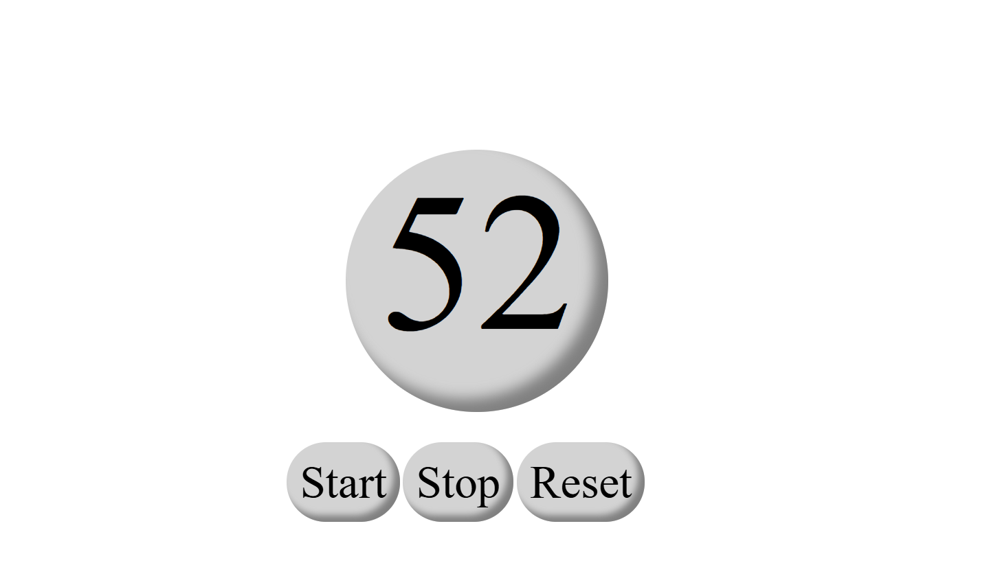

# ⏳ Countdown Timer Web App

A clean and responsive countdown timer built using **HTML**, **CSS**, and **JavaScript**. This app lets users start, stop, and reset a 60-second timer using a circular animated UI.

---

## 📸 Preview

Use the buttons below the timer to control the countdown.

---

## 🚀 Features

- ⏱ 60-second countdown
- ▶️ Start, ⏸ Stop, and 🔁 Reset controls
- 🌀 Circular UI with neumorphism-style design
- 💡 Responsive layout using `vw`, `vh`
- 🔘 Button press animations

---

## Project Structure

Timer/
├── Timer.html # Timer layout
├── Timer.js # JavaScript logic
├── Screenshot.png # (This image file)
└── README.md # This documentation
